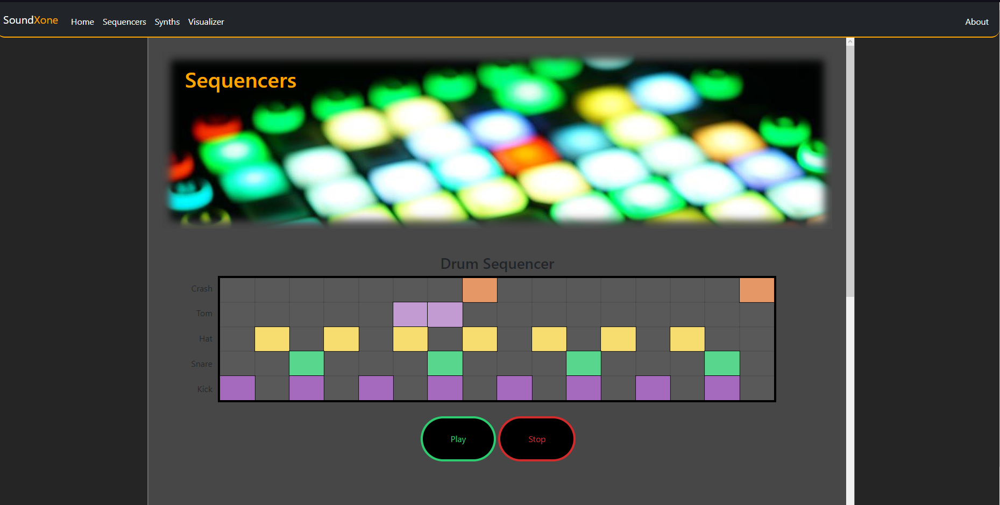
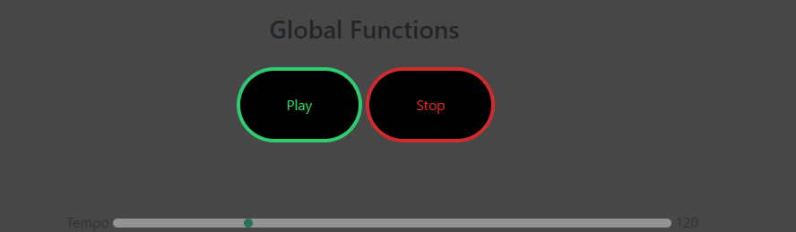
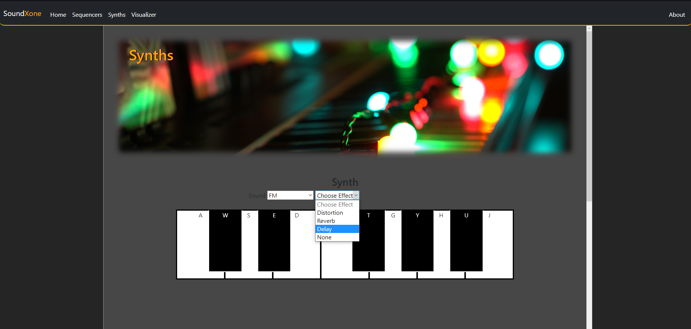
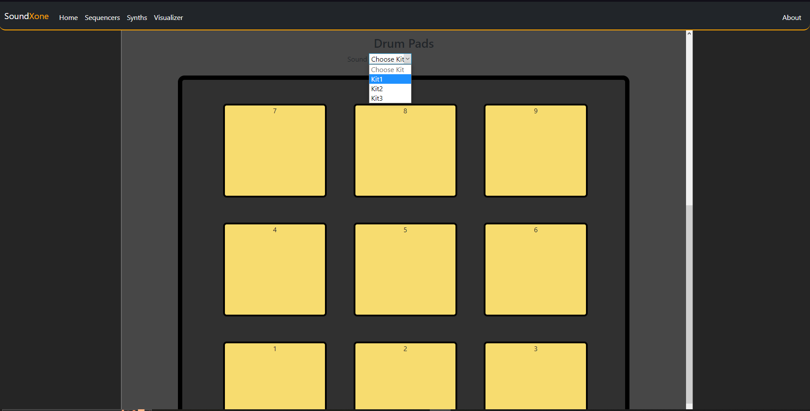
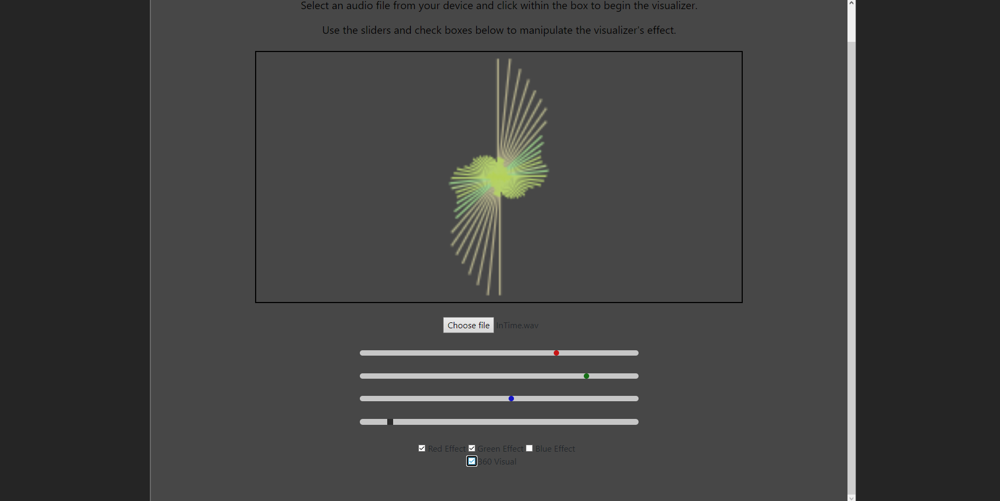
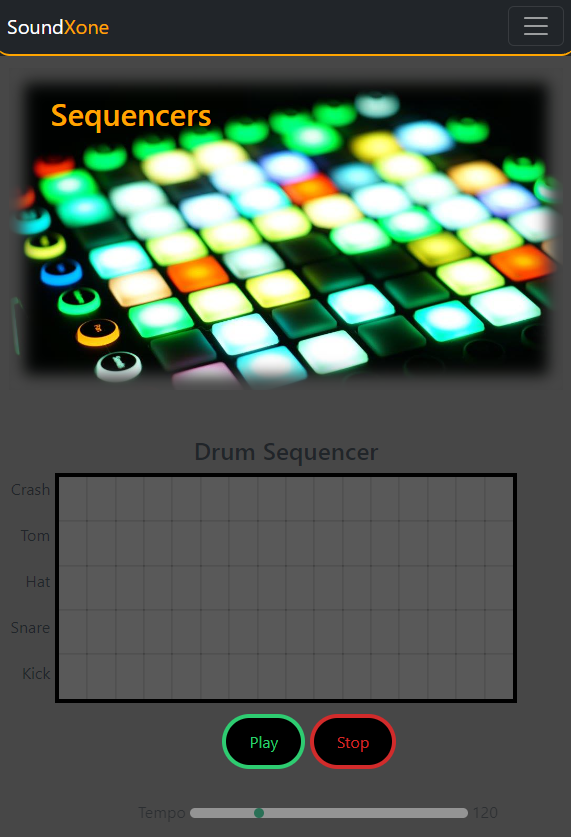
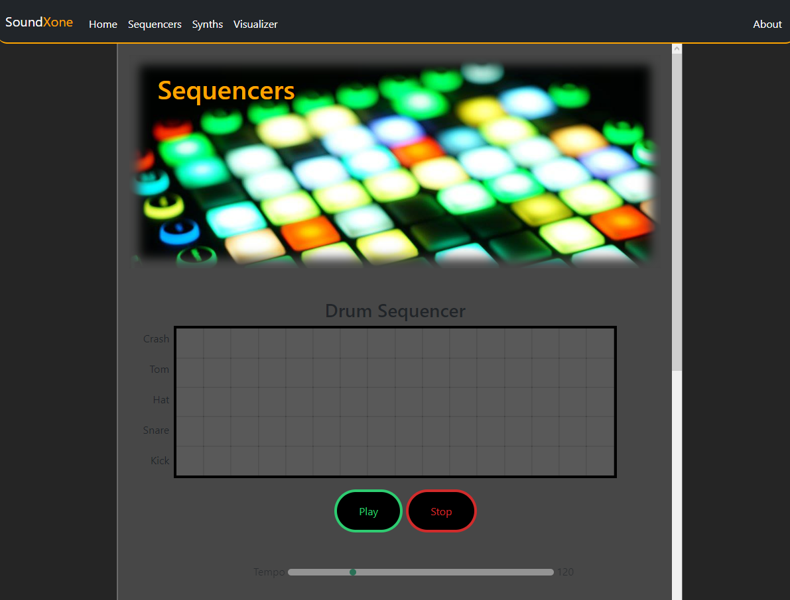

# SoundXone
### Video Demo: https://www.youtube.com/watch?v=UNMVS9AJJYw
## Description:
This is my final project for CS50's Introduction to Computer Science, a web application designed as a kind of "audio playground" in which users can interact with sequencers, synths and drum pads to create simple beats and play live instruments.

The bulk of my project's functionality and design was written in Javascript, HTML and CSS and I used Python's Flask library to tie it all together. I used Bootstrap for the navbar design and the [Tone.js](https://tonejs.github.io) Javascript library to create different audio-related aspects of the application such as, synth and drum sounds.


## Sequencers

### Layout & Functionality
The "Sequencers" page has two audio sequencers one for drums and one for melody. Each sequencer is comprised of sixteen steps which users can click to add/remove a drum or note, as shown below.



Both sequencers had "play" and "stop" buttons as well as a tempo slider. At the bottom of the page are the global functions which control both sequencers.



### Design Choices
The sequencers were created using a `div` element in which I used Javascript and a `for` loop to create all of the individual boxes inside, giving them each a row and column number, as per the code below.
```
// Add "pads" to sequencer element, adding column, row, value and duration
const sequencer = document.querySelector(".sequencer#drum-sequencer");
let col = 0;
let row = 0;
let val = "";
let dur = "";
for (let i = 0; i < (5*16); i++)
{
    if (row === 0){
        val = "C4";
        dur = "4n";
    }
    else if (row === 1){
        val = "C4";
        dur = "8n";
    }
    else if (row === 2){
        val = "C6";
        dur = "32n";
    }
    else if (row === 3){
        val = "";
        dur = "4n";
    }
    else {
        val = "C2";
        dur = "8n";
    }
    sequencer.innerHTML += `<div class='pad' data-col='${col}' data-row='${row}' data-duration='${dur}' value='${val}' onclick='padClick(this)'></div>`;
    col++;
    if (col === 16)
    {
        col = 0;
        row++;
    }
};
```
I desigined the "play" and "stop" buttons to look roughly like the function buttons on my Launchpad MIDI controller pictured in the hero image at the top of the page. I achieved this using HTML and CSS.

## Synths

### Layout & Functionality
The "Synths" page features a keyboard and a drum machine. Users can choose a synth sound and add effects via the dropdown menus above the keyboard:


A drum kit can also be chosen using the dropdown list located above:


Users can play the keys and drums either by clicking/touching the respective element, or by using their computer keyboard the keys to use are shown on each key and pad. This functionality was added
with Javascript.


### Design
The majority of the synths page, such as the keys and drum pads, was designed using HTML `div` elements styled with CSS, for example, the keyboard is made up of `div` elements, positioned and styled via the CSS code below.

```
.keyboard {
    position: relative;
    border: 1px solid black;
    height: 20%;
    width: 70%;
    margin-left: auto;
    margin-right: auto;
    margin-bottom: 10%;
}

    .keys {
        position: relative;
        height: 100%;
        text-align: center;
    }

        .white-key {
            position: relative;
            display: inline-block;
            border: 2px solid black;
            background-color: white;
            float: left;
            height: 100%;
            width: 14.28%;
            user-select: none;
        }

            #key[value="C"] {

            }
            #key[value="D"] {

            }
            #key[value="E"] {

            }
            #key[value="F"] {

            }
            #key[value="G"] {

            }
            #key[value="A"] {

            }
            #key[value="B"] {

            }

        .black-key {
            position: absolute;
            color: white;
            float: left;
            border: 2px solid white;
            border-top: 2px solid black;
            background-color: black;
            height: 90%;
            width: 10%;
            user-select: none;
        }

            #key[value='C#4'] {
                left: 9.5%;
            }

            #key[value='D#4'] {
                left: 24%;
            }

            #key[value='F#4'] {
                left: 52%;
            }

            #key[value='G#4'] {
                left: 66.5%;
            }

            #key[value='A#4'] {
                left: 81%;
            }
```

## Visualizer

### Layout and Functionality
The "Visualizer" page gives users the ability to play an audio file from their device, to which a visualization will be displayed. Users can then manipulate the visualization using RBG sliders and add effects, such as "360 Visual", via the check boxes, as per the below image.



### Design
This page has quite a minimalist design as I wanted the visualizer to be the eye catching element, which is why there is no hero image at the top of the page.

The visualizer itself was created and colored using Javascript. The code below shows how I implemented some of these design features to the visual itself.

```
// Loop the bars
            for (let i = 0; i < buffer_length; i++)
            {
                // Get RGB and "spread" values from sliders
                let red_val = document.getElementById('red').value;
                let green_val = document.getElementById('green').value;
                let blue_val = document.getElementById('blue').value;

                let effect = document.getElementById('effect').value;

                let red_effect = document.getElementById('red-effect').checked;
                let green_effect = document.getElementById('green-effect').checked;
                let blue_effect = document.getElementById('blue-effect').checked;

                bar_height = data[i] / 2; // Set the bar height to 'data' array's ith value

                if (effect > 0)
                {
                    effect = bar_height / 2 - (effect * 2) + i;
                    console.log(bar_height);
                }

                // Set RGB values to the canvas fillStyle
                red = red_val;
                if (bar_height / 2 > 15 && bar_height / 2 < 20 && red_effect)
                {
                    red = red_val - effect;
                }
                else
                {
                    red = red_val;
                }
                green = green_val;
                if (bar_height / 2 > 20 && green_effect)
                {
                    green = green_val - effect;
                }
                else
                {
                    green = green_val;
                }
                blue = blue_val;
                if (bar_height / 2 < 15 || bar_height / 2 > 25 && blue_effect)
                {
                    blue = blue_val - effect;
                }
                else
                {
                    blue = blue_val;
                }
                c.fillStyle = `rgb(${red}, ${green}, ${blue})`;

                // Draw rectangles on the canvas
                c.fillRect(canvas.width / 2 - bar_width - bar, canvas.height - bar_height, bar_width, bar_height);
                c.fillRect(canvas.width / 2 + bar, canvas.height - bar_height, bar_width, bar_height);
                bar += bar_width; // Increment 'bar' to draw along the canvas
            }
```

## Overall Design
I created my web app to be adaptive in design so, it should function all the same when used on a mobile device, or on a wider screen such as a computer monitor. The images below show some of how the page adapts to different screen sizes.

 

As you can see, the navbar turns to a hamburger menu on a smaller screen (thanks to Bootstrap) and the margins at the side of the page disappear, achieved via the CSS code below.

```
@media only screen and (max-width: 1000px) {
    #content {
        width: 100vw;
        left: 0;
    }
```

## Final Thoughts
I had a lot of fun (and frustration!) creating my final project for CS50 and learned a lot along the way. Going from never using Javascript, HTML or CSS before CS50, to creating a web app from scratch, in which most of the functionality is written in Javascript, was a great experience.

For me, the design was the most difficult part of the project. Making the website adapt to different screen sizes and everything stay relative to the screen was a challenge but I now feel pretty comfortable and confident in my CSS abilities.

Overall, I'm very proud of the outcome, I put a lot of work into this and I hope it shows.

I'm super greatful to all of the CS50 team for putting the hard work into creating this course and making it available to the world.

My name is Greg Duke and this was my final project for CS50.